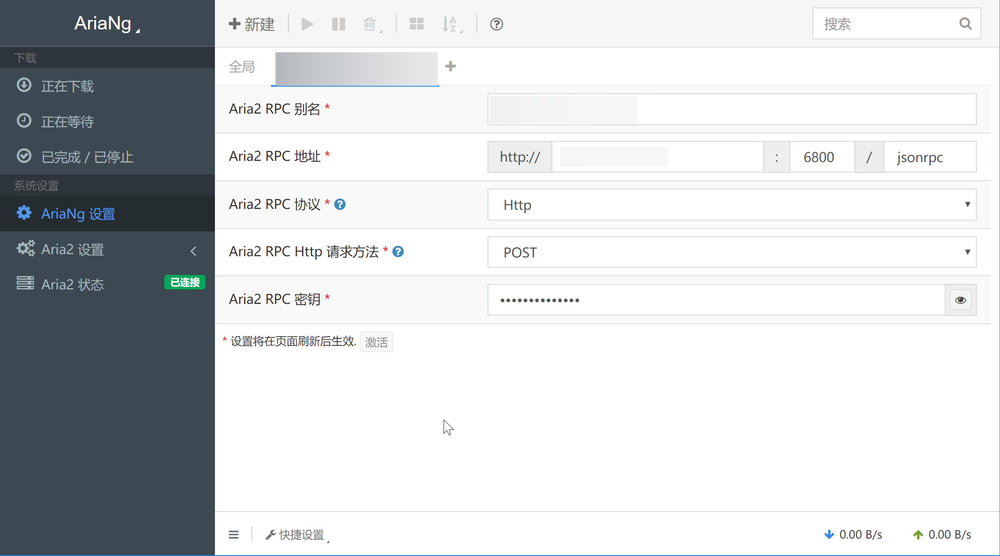

>前面已经搞定了百度盘还有googledrive，基本上所有的功能都能实现了，但是由于大百度对某些资源的和谐不是很好，所以还是要研究一下怎么把资源下载到服务器上的办法，好在我们有神器aria2，本章主要研究怎么在linux上安装，至于windows和mac的话，请自行研究。


感谢各位大神在github上造的各种轮子，让我们这些小白也能享受生活,话不多说走起！
这里采用的是一件安装工具，支持的系统有`Debian 8 +`、`Ubuntu 16+`前提是需要域名解析。

<!--more-->

```bash
wget https://www.moerats.com/usr/shell/Aria2_gdlist.sh && bash Aria2_gdlist.sh

#输入GDlist域名
请输入你的GDlist域名信息:

#设置Aria2密钥
请输入你的Aria2密钥:

#配置Rclone，大致如下
n) New remote
s) Set configuration password
q) Quit config
n/s/q> n
name> aaa  #随便填，后面要用到
Type of storage to configure.
Choose a number from below, or type in your own value
 1 / Alias for a existing remote
   \ "alias"
 2 / Amazon Drive
   \ "amazon cloud drive"
 3 / Amazon S3 (also Dreamhost, Ceph, Minio, IBM COS)
   \ "s3"
 4 / Backblaze B2
   \ "b2"
 5 / Box
   \ "box"
 6 / Cache a remote
   \ "cache"
 7 / Dropbox
   \ "dropbox"
 8 / Encrypt/Decrypt a remote
   \ "crypt"
 9 / FTP Connection
   \ "ftp"
10 / Google Cloud Storage (this is not Google Drive)
   \ "google cloud storage"
11 / Google Drive
   \ "drive"
12 / Hubic
   \ "hubic"
13 / Local Disk
   \ "local"
14 / Microsoft Azure Blob Storage
   \ "azureblob"
15 / Microsoft OneDrive
   \ "onedrive"
16 / Openstack Swift (Rackspace Cloud Files, Memset Memstore, OVH)
   \ "swift"
17 / Pcloud
   \ "pcloud"
18 / QingCloud Object Storage
   \ "qingstor"
19 / SSH/SFTP Connection
   \ "sftp"
20 / Webdav
   \ "webdav"
21 / Yandex Disk
   \ "yandex"
22 / http Connection
   \ "http"
Storage> 11  #选择11，Google Drive
Google Application Client Id - leave blank normally.
client_id>  #留空
Google Application Client Secret - leave blank normally.
client_secret>  #留空 
Scope that rclone should use when requesting access from drive.
Choose a number from below, or type in your own value
 1 / Full access all files, excluding Application Data Folder.
   \ "drive"
 2 / Read-only access to file metadata and file contents.
   \ "drive.readonly"
   / Access to files created by rclone only.
 3 | These are visible in the drive website.
   | File authorization is revoked when the user deauthorizes the app.
   \ "drive.file"
   / Allows read and write access to the Application Data folder.
 4 | This is not visible in the drive website.
   \ "drive.appfolder"
   / Allows read-only access to file metadata but
 5 | does not allow any access to read or download file content.
   \ "drive.metadata.readonly"
scope> 1  #设置权限，选择1
ID of the root folder - leave blank normally.  Fill in to access "Computers" folders. (see docs).
root_folder_id>  #留空 
Service Account Credentials JSON file path  - leave blank normally.
Needed only if you want use SA instead of interactive login.
service_account_file>  #留空 
Remote config
Use auto config?
 * Say Y if not sure
 * Say N if you are working on a remote or headless machine or Y didn't work
y) Yes
n) No
y/n> n  #选择n
If your browser doesn't open automatically go to the following link: https://xx  #复制到浏览器获取验证码
Log in and authorize rclone for access
Enter verification code>  #填入上面获取到的验证码
Configure this as a team drive?
y) Yes
n) No
y/n> y  #选择y
Fetching team drive list...
No team drives found in your account--------------------
[rats]
type = drive
client_id = 
client_secret = 
scope = drive.readonly
root_folder_id = 
service_account_file = 
token = {"access_token":""}
team_drive = 
--------------------
y) Yes this is OK
e) Edit this remote
d) Delete this remote
y/e/d> y  #选择y
Current remotes:

Name                 Type
====                 ====
Rats                 drive

e) Edit existing remote
n) New remote
d) Delete remote
r) Rename remote
c) Copy remote
s) Set configuration password
q) Quit config
e/n/d/r/c/s/q> q  #选择q退出

#最后输入Name和需要挂载的文件夹
请输入你刚刚输入的Name:
请输入你云盘中需要挂载的文件夹:

```
GDlist的说明不是本文的重点，这里不去介绍，想知道用法的请自行google。
最后`Aria2ng`的访问地址为`ip:8000`，然后填上密匙即可下载文件。

界面如下，在秘钥那设置自己设置的秘钥即可使用。


<p id="div-border-left-red">这里稍微说下这个工具的一些优缺点，就我使用的情况来看种子和磁性链接支持较好。</br>
对于FTP会存在下载错误的情况，而且不支持电驴连接，笔者的建议是结合百度网盘linux界面版一起使用，这样很多资源会很快秒下。</br>
然后被和谐的资源可以用这个下载，这样就能达到最佳效果。下载完毕后再把资源mv到google网盘简直完美！</br>
这里需要提醒下的是如果下载目录直接写google的挂在目录会偶尔导致错误，我的建议是先下载到本地再mv到google网盘。</p>