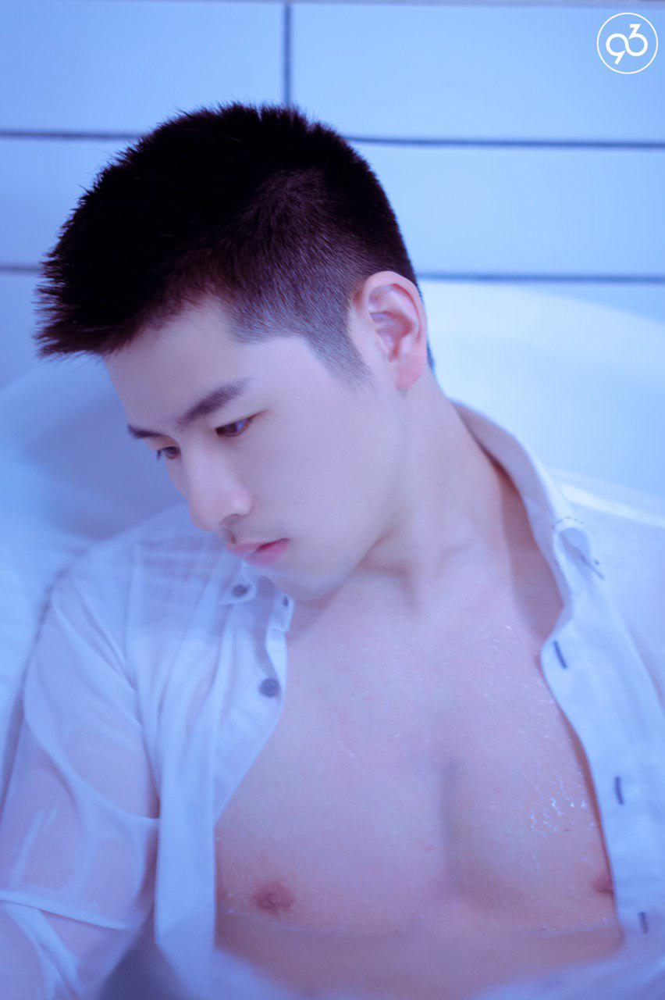
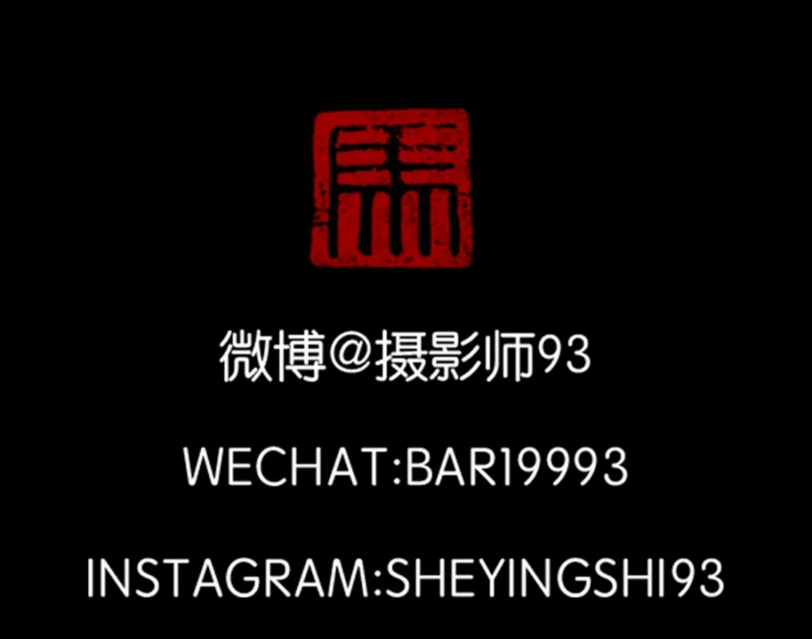

五一回家问刚上高中的表弟，他最想做什么样的工作，他拿着手机打开B站和我说想当个UP主。哈哈，听到后我倒是一点都不意外，在日本做过一个调查，现在的年轻人最喜欢的工作是什么，得票最高的是YouTuber。倒不是说现在的年轻人都死宅，不愿意受苦，我觉得他们还是希望被关注的那种满足吧。有句话怎么说来着，努力不一定成功，不努力一定很舒服，对于有肯定结果的事情不用怀疑，这不是很正常的事情吗，搞笑的话先说到这里，这里说说我小时候最喜欢的工作。

<!--more-->

我觉得每个人小时候都会想象自己长大以后的工作，要不然也会有许巍那句“曾梦想仗走天涯”。幻想自己以后当个警察，泡好看的小哥哥，幻想自己学会忍术，隐分身组一个球队，幻想自己吃了橡胶果实，下面能大能小，让那些骚0在胯下臣服。打住！宝宝那个时候还是个孩子，脑子里怎么会有这么邪恶的想法。

小时候由于受到当时阅读书本的影响，长大后有两个我最喜欢的职业，一个是图书管理员，一个是到处跑的摄影师。

图书管理员是因为我小时候特别喜欢看课外书，当时学校附近有那些买盗版书的商，把一些作品排版的很小字，定成一册拿来卖，比如韩寒全集，三毛全集，这些盗版商让我们这些贫穷的学生有了看外面世界的机会，这里想到自己第一次因为一本书而流眼泪的书就感到好笑，那个时候可爱淘还蛮流行，我看的第一本言情小说叫《那小子真帅》《狼的诱惑》，现在想想，蛮傻逼的。记得有次吃饭的时候我和我爸说，我长大以后想当图书馆员，我爸听了以后很生气，说我没出息，千万不能这么想，现在想来，图书管理员都是了不起的人，不说少林扫地僧，伟大的毛泽东主席和爱因斯坦可都当过图书管理员。

另外一个理想就是当个摄影师环游世界吧，感觉这个是受到三毛的影响吧，毕竟美少女们的征途是星辰大海。
我一直认为我们受教育的目的在于更好的认识这个世界和自己，读书可以让你认识自己，知道自己想要成为什么样子的人，到处跑可以让你更好的认识这个世界，探索未知，充满好奇不就是人类不断前进的原动力么。

令人惋惜的是，小时候的梦想总归只能想想，生活有很多无奈，所以我很敬佩那些做喜欢的事情并且可以养活自己的人。

特别是下面这位小哥哥，这个工作简直是我的梦寐以求。
他的工作是全国到处跑，拍好看的小哥哥，天惹，这简直是美好的男孩子收藏馆，把那些美好的肉体像标本一样，收到自己的博物馆里，想想就幸福。而且小哥哥自己还超级好看，明明可以靠颜值，非要靠才华，而且还这么努力，怪不得我只是咸鱼。

好了，说了这么多总该放些福利。

 

 

 

 

 

 上面都是这位小哥哥拍的照片啦，这位小哥哥自己长得也很好看哦。
 留下小哥哥的微信公众号，说真的，其实我不太想把下面的地址贴出来，因为这么好的小哥哥只能属于我，你们都走开，情敌们，拔剑吧！
 [快快点击](https://mp.weixin.qq.com/s?__biz=MzI1NDQ5MzAxMg==&mid=2247484646&idx=1&sn=e4d3ff3f4c7a40da894165a910cb5c01&chksm=e9c52cdddeb2a5cb7a29162264213f9e9a727144027c3ed3f31730bc0d665a31e4bbc41ea9b1&mpshare=1&scene=1&srcid=0318GoECOblaT55hXrC9U0Ch&key=64b5b2c11d4b7b9aa1c68ace67a26b0a60eefa4e5032fb10f17e7c7062a1e858e714e08ed665903945e35e3463b50959fe449fb8f27f6f77003f8a1dcf010788ac70fe73b29dfab67b1f161f6bf0d8b6&ascene=1&uin=Mjc5MDU4ODcyMA%3D%3D&devicetype=Windows+10&version=6206081f&lang=zh_CN&pass_ticket=zCPbuhNolq7WgFFJgt0%2FI4AKKaW1ZTSRZbmdmYVxDgrli7iaOM74dXxLA85DsA7w)

 