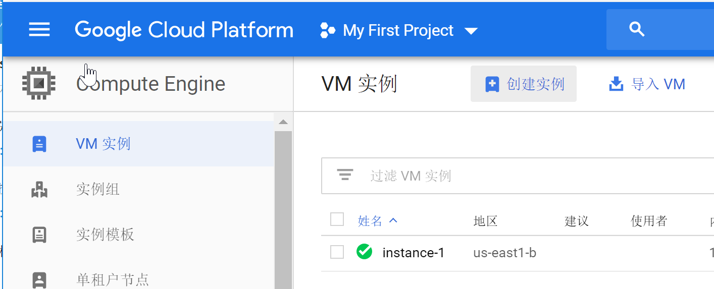
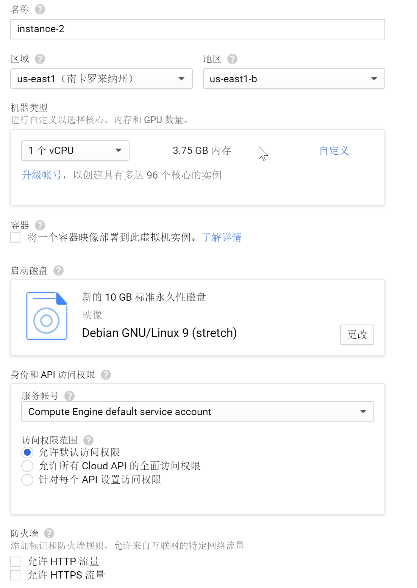
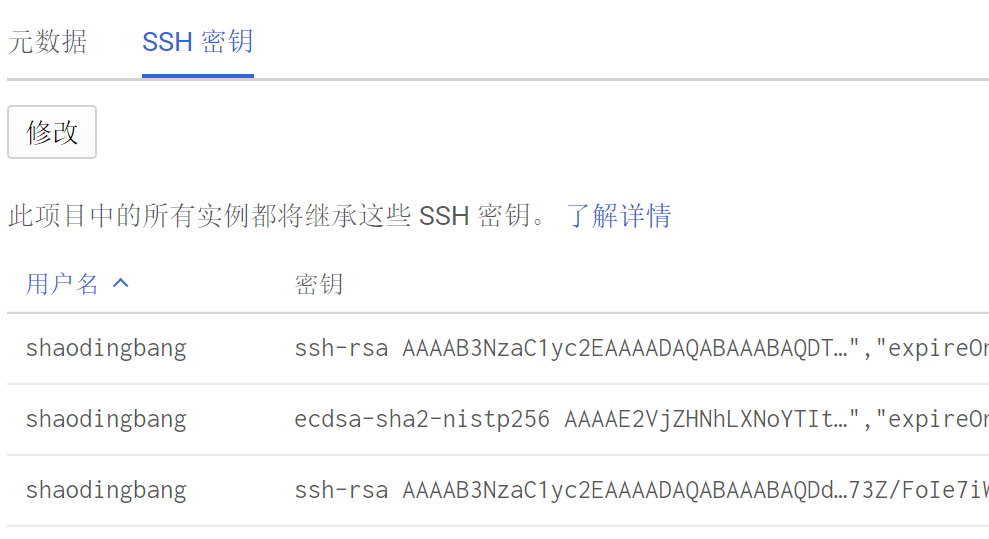

<p id="div-border-left-red">telegram关于各种校友邮箱翻车的传言不断传过来，内心还是慌张的，毕竟自己那么多资源在里面呢，最后还是买了域名上了google的官方车，我的钱包那叫一个心疼啊，不过这真金白银的下去就要好好用了。</p>
<!--more-->

## 简介
google clound Platform（简称GCP）现在有个免费一年300刀的活动，可以开始薅羊毛了。你所需要的是一张`visa`或者`MasterCard`信用卡，笔者试了招商银行的`visa`卡，可以通过。这里面的具体步骤这里就不再赘述了。

## 介绍
首先进入Computer Engine以后，先创建一个实例，选择合适自己的套餐。



打开HTTP流量和HTTPS流量开关。
实例创建完成以后可以看到该实例的外部IP和内部IP。

下面其实可以用chrome来连接服务器了，但是网页来连接会有各种操作卡顿的问题。下面需要添加公钥让本地ssh工具访问。
本地生成公钥密码后，在控制台选择`元数据`，选择其中的ssh密钥，修改=》添加本地的公钥。


本地的ssh工具上  
```bash
ssh 用户名@IP #就可以成功进入实例了，如果有问题请参照上一篇文章
sudo -i #获取root权限
```