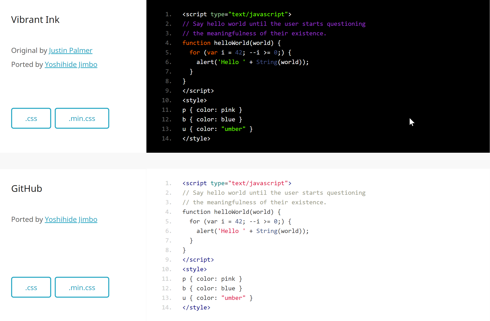

<p id="div-border-left-purple">相信大家很多时候都会觉得，哎呀这个代码的样式真是丑，这个地方怎么可以这个颜色，我要的高亮和字体哪里去了，这里怎么会变得这么丑，我的神呀，我是处女座的小乖乖，我受不了呀。当然我们伟大的nexT自带了四个主题，可是四个主题哪里够我们玩耍，我们的征途可是星辰大海。</p>
<!--more-->

### 介绍下 google pretty code
代码在这里，有兴趣的观摩下。
<https://github.com/google/code-prettify>

### 支持语言
code-prettify的GitHub页面中列出了支持的语言：
C and friends, Java, Python, Bash, SQL, HTML, XML, CSS, JavaScript, Makefile, and Rust.以及Ruby, PHP, VB, and Awk and a decent subset of Perl and Ruby
其他语言解析不在prettify.js中，需要手动加载额外的js文件，可在prettify-4-Mar-2013.tar.bz2压缩包的src文件夹内找到这些语言的解析js

除此之外还有丰富的皮肤可供选择，地址在[这里](https://jmblog.github.io/color-themes-for-google-code-prettify/)。
效果图如下：

这里面效果图有深色皮肤和浅色皮肤，网友可以根据自己的喜好选择。

### 下面说说安装方法。

#### 下载google code prettify，解压后把代码放到hexo/source/plugins/prettify目录下
[下载地址](https://raw.githubusercontent.com/google/code-prettify/master/distrib/prettify-small.zip)
将下载的目录解压到下面的文件夹
~\themes\next\source\lib\prettify
将从上面下载的皮肤css文件下载到
~\themes\next\source\lib\prettify\skins

#### 禁用hexo本身的代码高亮设置设置google-prettify
修改主题配置文件
```
# highlight:
#   enable: true
#   line_number: true
#   auto_detect: true
#   tab_replace:

highlight:
  enable: false
  line_number: false
  auto_detect: false
  tab_replace:

#自定义高亮代码（google prettify code）
#这里面填写你想要的皮肤
custom_highlight_theme: atelier-dune-light
```
#### 添加prettify
在~\themes\next\layout\_third-party中新建prettify.swig文件，并在里面填写下面内容
```javascript
<link rel="stylesheet" href="/lib/prettify/skins/{{ theme.custom_highlight_theme }}.css" type="text/css">
<script src="/lib/prettify/prettify.js" type="text/javascript"></script>
<script type="text/javascript">
  $(document).ready(function() {
      $('pre').addClass('prettyprint linenums').attr('style', 'overflow:auto;');
      prettyPrint();
  });
</script>
#注意上面的文件夹位置要与你安装的位置名字一致
```
在~/themes/next/layout/_layout.swig中添加下列引用
```html
 #添加google prettify 代码样式#
  
```
这样重新部署以后就可以看到效果了