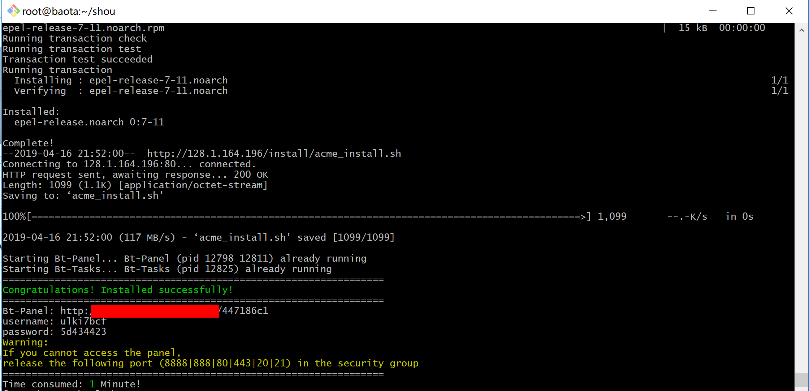
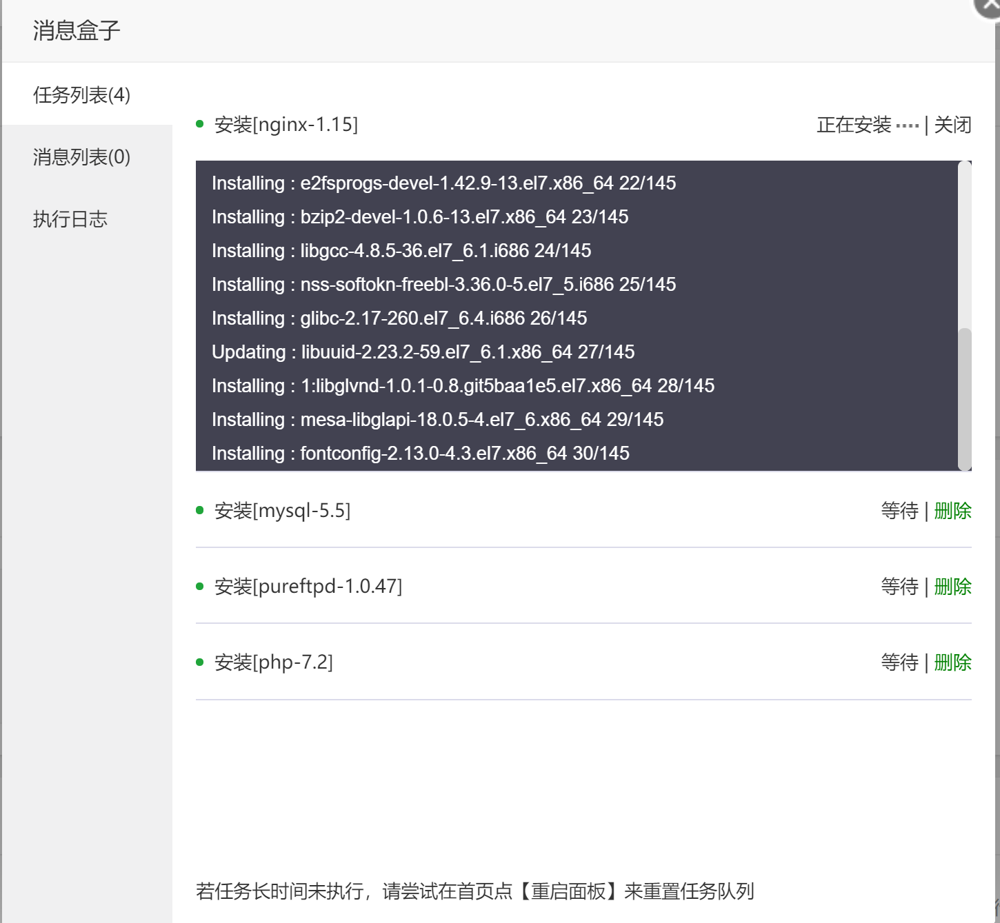
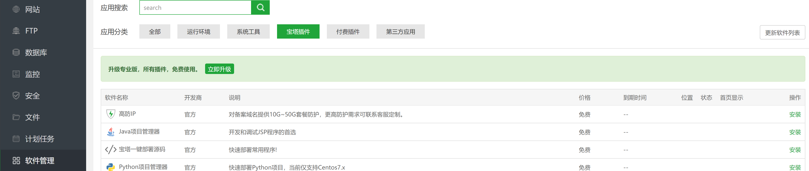
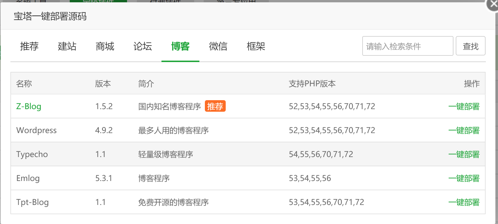
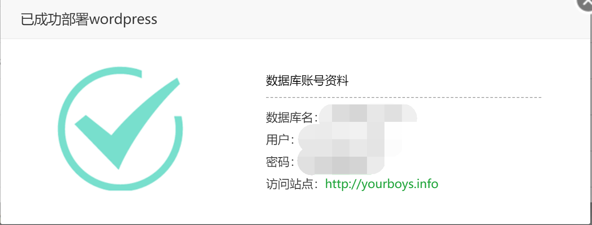
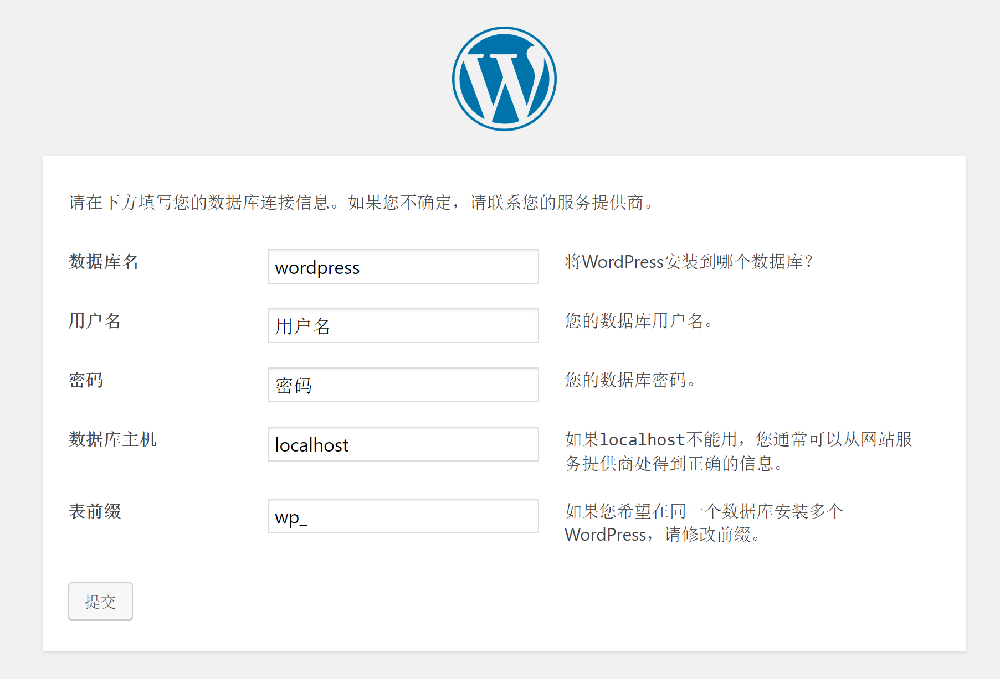

<p id="div-border-left-purple">生命不息，折腾不止。最近在网上看了比较著名的WordPress和typecho博客系统，当然我是不准备把这个转过去了，毕竟githubpage可以免费托管。但是该学习了解的还是要了解。网上所说的是WordPress用的人最多，但是速度不够快，typecho貌似用的人还蛮多，也有不错的主题。但是这两款暂时都没有尝鲜的打算，在接触的过程中了解到伟大的宝塔，这里先介绍下宝塔。</p>

<!--more-->

##  准备
首先希望你的系统比较干净，没有暗转过  mysql apache这些。
```bash
#CentOS系统
wget -O install.sh http://download.bt.cn/install/install_6.0.sh && sh install.sh
#Ubuntu系统
wget -O install.sh http://download.bt.cn/install/install-ubuntu_6.0.sh && sudo bash install.sh
#Debian系统
wget -O install.sh http://download.bt.cn/install/install-ubuntu_6.0.sh && bash install.sh
```

## 安装
安装完成后会 提示URL和用户名密码，请保存记住。

>提示：如果我们后续未修改密码却忘记了密码的话，可以在SSH客户端使用命令bt default来查看安装后的默认后台信息。

后台登陆，这个时候宝塔会提示让我们选择环境。


相信大家都是小vps啦，这里建议选择LNMP，环境为Nginx 1.15、PHP 7.2、Mysql 5.5，如果内存1G建议选择Mysql 5.6、2G选择5.7。选择好了后点击一键安装即可。
安装完成后，点击左侧软件管理-宝塔插件，安装`宝塔一键部署源码`，装好后点击设置。




安装完成后会提示数据库的名称密码，请保存好。

>提示：如果忘记了数据库信息，可以点击面板左侧-数据库进行查看。

## wordpress
这里尝试安装了WordPress，安装完成后进入你设置的域名会带你设置。

其他blog以及WordPress的高级设置，亲们可以自己研究。