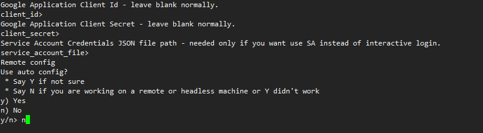

>有了无限容量的gdriver应该怎么办，当然是挂载服务器上啦。
>下面介绍gdriver挂载在服务器上的三种方法

### 准备工作
    无论采用什么方法都需要google账号开通api权限，取得认证。
    在google api中取得凭据  客户端ID和客户端秘钥

    
<!--more-->

### Rclone（推荐）

```bash
yum -y install wget unzip screen fuse fuse-devel
wget https://downloads.rclone.org/v1.39/rclone-v1.39-linux-amd64.zip
unzip rclone-v1.39-linux-amd64.zip
cd rclone-v1.39-linux-amd64
./rclone config
```
执行完上述命令后进入选择阶段新的一个远程桌面，并给他去一个名字
然后选择需要挂载的网盘 google drive是 10
接着client_id、client_secret、service_account_file都留空直接回车，Use auto config这里我们选择n，如下图：

rclone会在终端内给我们回显一个GoogleDrive的授权登录地址，我们将登陆地址输入到浏览器中，然后把取得的认证码输入到ssh框中就好。
然后进行确认操作，是否设置为团队盘，对这个远程盘进行操作，以及退出，分别选择n,y,q

执行加载命令并查看效果
```bash
mkdir -p /lala/gdrive
./rclone mount lala: /lala/gdrive --allow-other --allow-non-empty --vfs-cache-mode writes&  #后台运行
df -h
#不出意外的话应该成功了
root@ubuntu-itachi:~# df -h
Filesystem      Size  Used Avail Use% Mounted on
udev            985M     0  985M   0% /dev
tmpfs           200M  884K  199M   1% /run
/dev/vda1        49G   13G   36G  27% /
tmpfs           997M     0  997M   0% /dev/shm
tmpfs           5.0M     0  5.0M   0% /run/lock
tmpfs           997M     0  997M   0% /sys/fs/cgroup
/dev/vda15      105M  3.6M  101M   4% /boot/efi
/dev/loop0       88M   88M     0 100% /snap/core/5662
/dev/loop1       67M   67M     0 100% /snap/lxd/9239
/dev/loop2       92M   92M     0 100% /snap/core/6531
/dev/loop3       54M   54M     0 100% /snap/lxd/10343
lala:           1.0P     0  1.0P   0% /lala/gdrive

#卸载
fusermount -u /lala/gdrive
```
### google-drive-ocamlfuse
```bash
#安装PPA
sudo add-apt-repository ppa:alessandro-strada/ppa
sudo apt-get update
sudo apt-get install google-drive-ocamlfuse
sudo add-apt-repository ppa:alessandro-strada/google-drive-ocamlfuse-beta
sudo apt-get update
sudo apt-get install google-drive-ocamlfuse
#安装opam以及相关依赖包
apt-get install opam
opam init
opam update
opam install depext
opam depext google-drive-ocamlfuse
#请输入自己的ID和秘钥
google-drive-ocamlfuse -headless -label googledrive -id 305766299019-xxxxx729a3ugtebaf1kfiq25s8cqeivb.apps.googleusercontent.com -secret PEAJdRInHTVf29Kx8EaXXXXX
#屏幕会提示
Please, open the following URL in a web browser: https://accounts.google.com/o/oauth2/auth?client_id=305766299019-xxxxx729a3ugtebaf1kfiq25s8cqeivb.apps.googleusercontent.com&redirect_uri=urn%3Aietf%3Awg%3Aoauth%3A2.0%3Aoob&scope=https%3A%2F%2Fwww.googleapis.com%2Fauth%2Fdrive&response_type=code&access_type=offline&approval_prompt=force
Please enter the verification code:

#浏览器中打开会得到一串verification code
4/qemZjOBy8MVI-dmaMPN3jJZ1ov_g6JbsdEeFfXXXXXX
#若果提示Access token retrieved correctly.则表示成功
mkdir $HOME/GoogleDrive
google-drive-ocamlfuse -label googledrive $HOME/GoogleDrive
#查看挂载状态
ubuntu@VM-120-252-ubuntu:~$ df -hl
Filesystem              Size  Used Avail Use% Mounted on
udev                    414M     0  414M   0% /dev
tmpfs                    87M  9.3M   78M  11% /run
/dev/vda1                50G  2.6G   45G   6% /
tmpfs                   433M   24K  433M   1% /dev/shm
tmpfs                   5.0M     0  5.0M   0% /run/lock
tmpfs                   433M     0  433M   0% /sys/fs/cgroup
tmpfs                    87M     0   87M   0% /run/user/500
google-drive-ocamlfuse   15G   21M   15G   1% /home/ubuntu/GoogleDrive
#卸载
fusermount -u $HOME/GoogleDrive
```

### GDriveFS（不推荐）。
```bash
yum -y install epel-release
yum -y install fuse fuse-devel python-pip python-devel gcc gcc-c++ openssl-devel
pip install --upgrade pip
pip install gdrivefs
gdfstool auth -u
#GDriveFS和Rclone一样，这里也会给你一个Google的登录授权地址：
#浏览器输入地址得到授权码
gdfstool auth -a /var/cache/gdfs.creds "你的授权码"
#显示 Authorization code recorded 表示成功
mkdir -p /lala/gdrivefs
gdfstool mount /var/cache/gdfs.creds /lala/gdrivefs
#如果遇到下面的错误请执行下面的命令
httplib2.SSLHandshakeError: [SSL: CERTIFICATE_VERIFY_FAILED] certificate verify failed

pip uninstall httplib2
pip install httplib2
gdfstool mount /var/cache/gdfs.creds /lala/gdrivefs
```
>这里面总结一下，上面的运行环境既有CentOS也有Ubuntu。网友可以根据自己的需要来选择相应的命令
我的运行的环境的Ubuntu，就我个人的使用情况来看 <span id="inline-blue">百度下载传输 </span>
Rclone最稳定，速度也最好，大概是因为优秀的cache机制。
