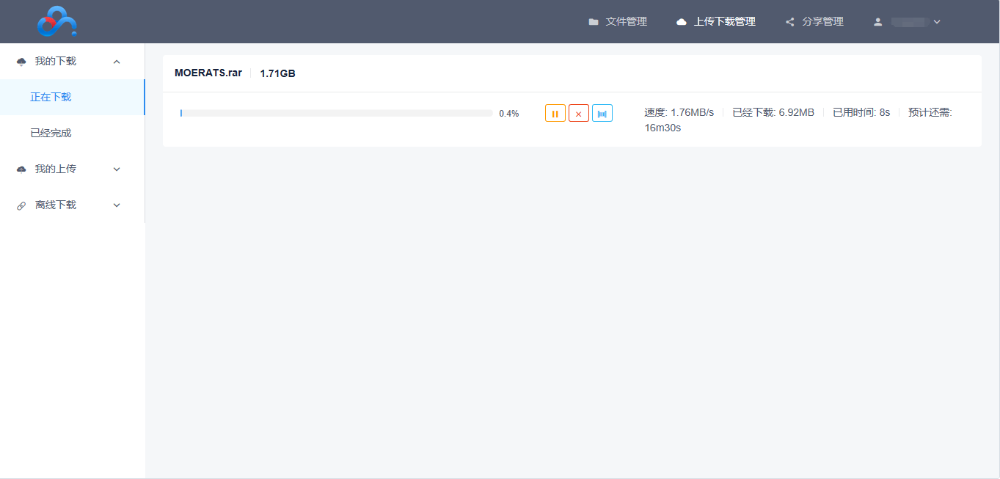

>上面已经成功把google网盘挂载到服务器上了，接下来如果吧百度云也挂上去的话，岂不是只要cp  -p 就能解决所有问题了，现实并没有那么理想，目前并没有找到将百度网盘挂载到系统上的方法，不过有下面两个方法可以解决。

<!--more-->

## BaiduPCS-Go

### Github地址 
<https://github.com/iikira/BaiduPCS-Go>

#### 下载
[点击查看](https://github.com/iikira/BaiduPCS-Go/releases)，找到适合自己服务器的版本，这里以vps64为例子。

```bash
#下载并解压程序，然后删除压缩文件
wget https://github.com/iikira/BaiduPCS-Go/releases/download/v3.5.6/BaiduPCS-Go-v3.5.6-linux-amd64.zip
unzip BaiduPCS-Go-v3.5.6-linux-amd64.zip && rm -rf BaiduPCS-Go-v3.5.6-linux-amd64.zip
```
#### 配置
```bash
#设置下载文件的储存目录，默认存在/root/Downloads
./BaiduPCS-Go config set -savedir /home

#设置下载最大并发量为200，建议值50~500，数值越大速度越高，但太高可能会出问题
./BaiduPCS-Go config set -max_parallel 200
```
#### 命令介绍
```bash
 #进入到之前解压的文件里运行相关命令
cd BaiduPCS-Go-v3.5.6-linux-amd64
#登录百度云盘
./BaiduPCS-Go login  #要求用户名 密码 图形验证码 短信验证等

#列出已登录百度帐号列表
./BaiduPCS-Go loglist
#获取当前百度帐号
./BaiduPCS-Go who
#切换当前的百度帐号，<uid>请在列表里查看
./BaiduPCS-Go su <uid>
#退出当前登录的百度账号
./BaiduPCS-Go logout

#查看网盘总空间和已使用的
./BaiduPCS-Go quota
```
#### 错误处理
如果下载的时候遇到下面的错误
`获取路径信息错误, 获取文件/目录的元信息: 网络错误, Post http://pcs.baidu.com/rest/2.0/pcs/file?app_id=266719&method=meta: `
`net/http: request canceled while waiting for connection (Client.Timeout exceeded while awaiting headers)`


请做如下处理
新规如下shell，命名为appid.sh并执行即可
```bash
item=266718
function check(){
    ./BaiduPCS-Go config set -appid=$item &> /dev/null
    ./BaiduPCS-Go ls | grep -q 遇到错误
    if [ $? != 0 ];then
        echo "当前可用appid：$item ，已设置成功，BaiduPCS-Go 现可用正常使用了！"
    else
        let item+=1
        check
    fi
}
check
```
>bash appid.sh


#### 下载文件
```bash
./BaiduPCS-Go d <网盘文件或目录的路径1> <文件或目录2> <文件或目录3> ...
#命令示范
#下载根目录rats.xx文件
./BaiduPCS-Go d rats.xx
#下载moe目录rats.xx文件
./BaiduPCS-Go d /moe/rats.xx

#下载根目录moe文件夹所有文件
./BaiduPCS-Go d /moe
#下载根目录moe文件夹的子文件夹rats所有文件
./BaiduPCS-Go d /moe/rats
```

#### 上传文件
```bash
#将服务器上的/root/rats.xx文件上传到网盘根目录moe文件夹，如果是根目录则用/
./BaiduPCS-Go u /root/rats.xx /moe

#将服务器上的/root/rats文件夹及里面的文件上传到网盘根目录moe文件夹，如果是根目录则用/
./BaiduPCS-Go u /root/rats /moe
```
这个工具命令实在太多，具体参照大佬的github。

>稍微总结下这个软件的优点。
支持`Windows`、`macOS`、`linux`、移动设备等。
百度帐号多用户支持。
下载网盘内文件，支持多个文件或目录下载，支持断点续传和单文件并行下载。
上传本地文件，支持上传大文件(>2GB)，支持多个文件或目录上传。
离线下载，支持http/https/ftp/电驴/磁力链协议。

>当然也有缺点
那就是命令实在是太多不太方便操作

>强烈推荐使用命令行，下面这个耗费资源较多。


## BaiduPCS-Web
>为了解决上面的命令繁琐的问题，有大神在上面的基础上做出了web版
地址在[这里](https://github.com/liuzhuoling2011/baidupcs-web)
程序的话，作者已经打包好了直接下载就好了，[下载地址](https://github.com/liuzhuoling2011/baidupcs-web/releases)

界面大概这个样子


windows的版本直接点开就可以了

下面介绍Linux
```bash
wget http://qiniu.zoranjojo.top/BaiduPCS-Go-3.6.5-linux-amd64.zip
#解压文件
unzip BaiduPCS-Go-3.5.8-linux-amd64.zip
#进入文件夹
cd BaiduPCS-Go-3.5.8-linux-amd64
#授权文件
chmod a+x BaiduPCS-Go
#运行
./BaiduPCS-Go &

#有可能防火墙需要设置下
#CentOS 6
iptables -I INPUT -p tcp --dport 5299 -j ACCEPT
service iptables save
service iptables restart

#CentOS 7
firewall-cmd --zone=public --add-port=5299/tcp --permanent
firewall-cmd --reload

```
然后使用浏览器访问`http://ip:5299`即可

>总结一下，该版本继承了上面软件的优点，并且有界面便于操作。
缺点也有，就是在下载大量文件会造成服务器卡顿，不如第一个稳定，不知道是不是我服务器太差的原因。


>有了上面两个大杀器就可以很简单的把我们的百度云盘的内容转到我们的无限gdrive啦
笔者经过三天的时间大概转了1.7T，速度还是很可以的。
用的就是上面的BaiduPCS-Go+rclone，希望可以给撸谷歌无限盘的玩家一些前车之鉴吧。